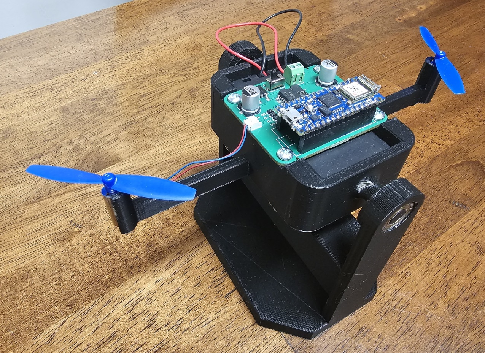

# System Identification and Control Design Experiments with the Arduino-Based Bi-Copter Hardware 
## Eniko T Enkiov, University of Arizona
## Melda Ulysoy, Mathworks Inc. 2024
This project aims to demonstrate the use of Matlab's system identification toolbox in developing dynamic models of an Arduino-Based  aero-mechatronic system. The system is compsized of two propellers mounted on a pivoting arm, along with Arduino-Nano-ITO and a battery pack. It is operated wirelessly via local WiFi network using Matlab's Simulink Arduino support package. Except for the 3D printed arm and stand, all other components are commerically available, allowing easy replication of the experiment. Additionally, a Simmechanics model replicates the hardware-based experience for users who prefer virtual experimentation. 

## Learning Goals
- Obtain linaer dynamic models from input-output data. Examples inlucde autoregressive models with exogenous input (ARX), state space model based on N4SID subspace method.
- Investigate the the effect of bandwidth and amplitude of the test input on the obtained model. 
- Evaluate different model orders using physical and numerical considerations (creiteria such as autocorrelelation and cross correlation of the resiudual)
- Learn how to design closed-loop controllers using PID and state space-based approaches. 

## Setup
- [Bi-copter 3D printing instructions](https://www.youtube.com/watch?v=3kPK0pJ30wg)
- [Bi-copter assembly instructions](https://www.youtube.com/watch?v=vzXoB-3JaGU)
- Download and install low-cost hardware support packages
 * [Simulink Support Package for Arduino](https://www.mathworks.com/hardware-support/arduino.html#simulink)
 * [MATLAB Support Package for Arduino](https://www.mathworks.com/hardware-support/arduino.html#matlab)

## Additional Resources
- [System Identification Tech Talks](https://www.mathworks.com/videos/series/system-identification.html)
- [MATLAB Onramp](https://www.mathworks.com/learn/tutorials/matlab-onramp.html) – a free two-hour introductory tutorial that teaches the essentials of MATLAB.
- [Simulink Onramp](https://www.mathworks.com/learn/tutorials/simulink-onramp.html) – a free three-hour introductory tutorial that teaches the essentials of Simulink.
- [Control Design Onramp with Simulink](https://matlabacademy.mathworks.com/details/control-design-onramp-with-simulink/controls) - learn the basics of feedback control design in Simulink.

## Products
MATLAB, Simulink, System Identification Toolbox™, Control System Toolbox™, Simscape™, Simscape Multibody™

## Educator Resources
- [MATLAB and Simulink Courseware](https://www.mathworks.com/academia/courseware.html)
- [Teaching Controls with MATLAB and Simulink](https://www.mathworks.com/academia/courseware/teaching-controls-with-matlab-and-simulink.html)
- [Teaching Modeling and Controls using MATLAB Live Scripts](https://www.mathworks.com/videos/teaching-modeling-and-controls-with-the-matlab-live-editor-1623992486476.html?s_tid=srchtitle_teaching%20modeling%20and%20controls_1)

